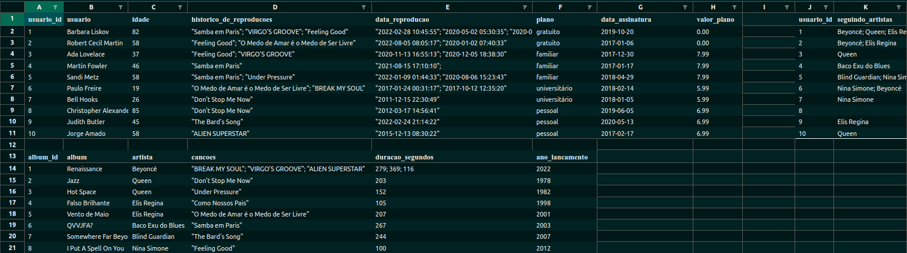

# seja bem-vindo(a) ao meu projeto mysql-one-for-all

# sobre o projeto
Nesse projeto eu recebo uma tabela com os dados todos bagunçados e tenho como missão orgazinar essas mesmas informações em um banco de dados seguindo as regras de normalização de dados do mysql, além de desenvolver queries para serem executas no banco de dados.

## tecnologias e ferramentas usadas
* mysql
* docker
 

  
<strong> :whale: Rodando no Docker</strong>
 

  > Rode os serviços `node` e `db` com o comando `docker-compose up -d`.
  -  O `docker-compose.yml` está configurado para mapear a porta padrão do `mysql` do container para a porta `3307` e não `3306`. 
  - Esses serviços irão inicializar um container chamado `one_for_all` e outro chamado `one_for_all_db`.
  - A partir daqui você pode rodar o container `one_for_all` via CLI ou abri-lo no VS Code.

  > Use o comando `docker exec -it one_for_all bash`.
  - Ele te dará acesso ao terminal interativo do container criado pelo compose, que está rodando em segundo plano;
  - As credencias de acesso ao banco de dados estão definidas no arquivo `docker-compose.yml`, e são acessíveis no container através das variáveis de ambiente `MYSQL_USER` e `MYSQL_PASSWORD`. 💡

  > Instale as dependências com `npm install`

  ⚠ Atenção ⚠ O **git** dentro do container não vem configurado com suas credenciais. Ou faça os commits fora do container, ou configure as suas credenciais do git dentro do container.

## desafios do projeto

## Desafio 1

* Crie um banco com o nome de **`SpotifyClone`**.

* Providencie as queries necessárias para criar tabelas normalizadas que atendam aos requisitos descritos na seção abaixo;

* Providencie as queries necessárias para popular as tabelas de acordo com os dados listados na seção abaixo;

  

    
<strong>🎲 Problema a ser resolvido - Normalização</strong>
 

  Você receberá uma tabela não normalizada semelhante ao que poderia ser uma versão simplificada do banco de dados do Spotify. O trabalho consistirá de duas partes:

  1. Normalizar essa tabela, criar o schema no seu banco de dados local e populá-lo;

  2. Realizar os desafios no seu banco normalizado e populado.

  **Observação:** O banco de dados real do Spotify é muito mais completo e complexo que o mostrado abaixo. No entanto, use APENAS as informações passadas e solicitadas aqui. Não crie dados que não foram solicitados.

  ## Normalize as tabelas para a 3ª Forma Normal

  Abaixo você pode visualizar e baixar uma planilha com as tabelas que deverão ser normalizadas:

  
  [Faça o download dela aqui](./SpotifyClone-Non-NormalizedTable.xlsx)
  Como o VS Code não oferece suporte para abrir planilhas, você precisa ter alguma software de especifico para isso, aqui deixamos algumas sugestões:
  - [LibreOffice Calc](https://www.libreoffice.org/download/download/) para distros Linux;
  - [Numbers](https://www.apple.com/br/numbers/) Mac OS;
  - Google planilhas para utilizar no browser;
  - Extensão para o VS Code como a Excel Viewer;

  > Obs. Em alguns SOs já costuma vir instalado algum programa para manipular planilhas.

  Seu banco de dados deve seguir as regras de negócio e ser capaz de recuperar:

  * Informações sobre quais planos estão disponíveis e seus detalhes;
    * Cada pessoa usuária pode possuir apenas um plano.

  * Informações sobre todas as pessoas artistas;
    * Uma pessoa artista pode ter vários álbuns;
    * Uma pessoa artista pode ser seguida por várias pessoas usuárias.

  * Informações sobre todos os álbuns de cada artista;
    * Para fins deste projeto, considere que cada álbum possui apenas uma pessoa artista como principal;
    * Cada álbum possui várias canções.

  * Informações sobre todas as canções de cada álbum;
    * Para fins deste projeto, considere que cada canção está contida em apenas um álbum.

  * Informações sobre todas as pessoas usuárias, seus planos, seu histórico de reprodução e pessoas artistas seguidas.
    * Uma pessoa usuária pode possuir apenas um plano;
    * Cada música do histórico de reprodução pode aparecer uma única vez por pessoa (para simplificar, considere que o objetivo do histórico é saber **quais** canções já foram reproduzidas e **não quantas vezes** foram reproduzidas);
    * Uma pessoa usuária pode seguir várias pessoas artistas, mas cada pessoa artista pode ser seguida apenas uma vez por pessoa usuária.

  

---

## Desafio 2

Crie uma `QUERY` que exiba três colunas:

1. A primeira coluna deve exibir a quantidade total de canções. Dê a essa coluna o alias "**cancoes**".

2. A segunda coluna deve exibir a quantidade total de artistas e deverá ter o alias "**artistas**".

3. A terceira coluna deve exibir a quantidade de álbuns e deverá ter o alias "**albuns**".

---

## Desafio 3

Crie uma `QUERY` que deverá ter apenas três colunas:

1. A primeira coluna deve possuir o alias "**usuario**" e exibir o nome da pessoa usuária.

2. A segunda coluna deve possuir o alias "**qt_de_musicas_ouvidas**" e exibir a quantidade de músicas ouvida pela pessoa com base no seu histórico de reprodução.

3. A terceira coluna deve possuir o alias "**total_minutos**" e exibir a soma dos minutos ouvidos pela pessoa usuária com base no seu histórico de reprodução.

Os resultados devem estar agrupados pelo nome da pessoa usuária e ordenados em ordem alfabética.

---

## Desafio 4

Crie uma `QUERY` que deve mostrar as pessoas usuárias que estavam ativas **a partir do ano de 2021**, se baseando na data mais recente no histórico de reprodução.

1. A primeira coluna deve possuir o alias "**usuario**" e exibir o nome da pessoa usuária.

2. A segunda coluna deve ter o alias "**status_usuario**" e exibir se a pessoa usuária está ativa ou inativa.

O resultado deve estar ordenado em ordem alfabética.

---

## Desafio 5

Estamos fazendo um estudo das músicas mais tocadas e precisamos saber quais são as duas músicas mais tocadas no momento. Crie uma `QUERY` que possua duas colunas:

1. A primeira coluna deve possuir o alias "**cancao**" e exibir o nome da canção.

2. A segunda coluna deve possuir o alias "**reproducoes**" e exibir a quantidade de pessoas que já escutaram a canção em questão.

Seu resultado deve estar ordenado em ordem decrescente, baseando-se no número de reproduções. Em caso de empate, ordene os resultados pelo nome da canção em ordem alfabética. Queremos apenas o top 2 de músicas mais tocadas.

---

## Desafio 6

Tendo como base o valor dos planos e o plano que cada pessoa usuária cadastrada possui no banco, queremos algumas informações sobre o faturamento da empresa. Crie uma `QUERY` que deve exibir quatro dados:

1. A primeira coluna deve ter o alias "**faturamento_minimo**" e exibir o menor valor de plano existente para uma pessoa usuária.

2. A segunda coluna deve ter o alias "**faturamento_maximo**" e exibir o maior valor de plano existente para uma pessoa usuária.

3. A terceira coluna deve ter o alias "**faturamento_medio**" e exibir o valor médio dos planos possuídos por pessoas usuárias até o momento.

4. Por fim, a quarta coluna deve ter o alias "**faturamento_total**" e exibir o valor total obtido com os planos possuídos por pessoas usuárias.

Para cada um desses dados, por se tratarem de valores monetários, deve-se arredondar o faturamento usando apenas duas casas decimais.

---

## Desafio 7

Mostre uma relação de todos os álbuns produzidos por cada pessoa artista, ordenada pela quantidade de seguidores que ela possui, de acordo com os detalhes a seguir. Para tal, crie uma `QUERY` com as seguintes colunas:

1. A primeira coluna deve exibir o nome da pessoa artista, com o alias "**artista**".

2. A segunda coluna deve exibir o nome do álbum, com o alias "**album**".

3. A terceira coluna deve exibir a quantidade de pessoas seguidoras que aquela pessoa artista possui e deve possuir o alias "**seguidores**".

Seus resultados devem estar ordenados de forma decrescente, baseando-se no número de pessoas seguidoras. Em caso de empate no número de pessoas, ordene os resultados pelo nome da pessoa artista em ordem alfabética e caso há artistas com o mesmo nome, ordene os resultados pelo nome do álbum alfabeticamente.

---

## Desafio 8

Mostre uma relação dos álbuns produzidos por um artista específico, neste caso `"Elis Regina"`.
Para isto crie uma `QUERY` que o retorno deve exibir as seguintes colunas:

1. O nome da pessoa artista, com o alias "**artista**".

2. O nome do álbum, com o alias "**album**".

Os resultados devem ser ordenados pelo nome do álbum em ordem alfabética.

---

## Desafio 9

Crie uma `QUERY` que exibe a quantidade de músicas que estão presentes atualmente no histórico de reprodução de uma pessoa usuária específica. Para este caso queremos saber quantas músicas estão no histórico da usuária `"Barbara Liskov"` e a consulta deve retornar a seguinte coluna:

1. O valor da quantidade, com o alias "**quantidade_musicas_no_historico**".
